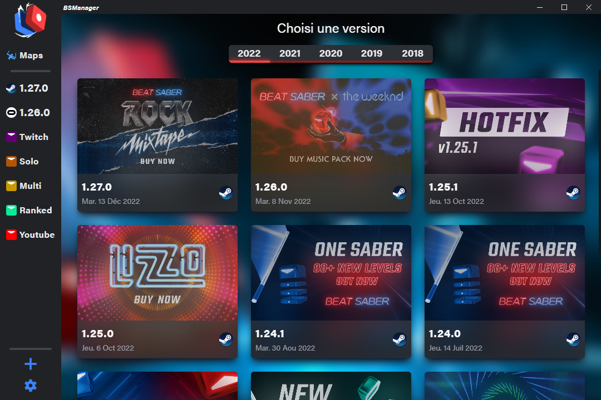

<!-- PROJECT SHIELDS -->
<!--
*** I'm using markdown "reference style" links for readability.
*** Reference links are enclosed in brackets [ ] instead of parentheses ( ).
*** See the bottom of this document for the declaration of the reference variables
*** for contributors-url, forks-url, etc. This is an optional, concise syntax you may use.
*** https://www.markdownguide.org/basic-syntax/#reference-style-links
-->

<!-- PROJECT LOGO -->

  
    
  <h2 align="center"><b>BS Manager</b></h2>
  <i align="center">(Beat Saber Manager)</i>
  

    Download, manage and customize your versions of Beat Saber with a simple click!
     
    <a href="https://github.com/Zagrios/bs-manager/issues/new?assignees=Zagrios&labels=bug&template=bug_report.md&title=%5BBUG%5D">Report Bug</a>
    ·
    <a href="https://github.com/Zagrios/bs-manager/issues/new?assignees=Zagrios&labels=enhancement&template=feature_request.md&title=%5BAME%5D">Request Feature</a>
     
  

 

  

[<a href="#readme-bot">go to bot</a>]

<h1> </h1>
<!-- TABLE OF CONTENTS -->
  <b>Table of Contents</b>
  <ol>
    <li>
      <a href="#about-the-project">About The Project</a>
      <ul>
        <li><a href="#built-with">Built With</a></li>
            <li><a href="#contributing">Contributing</a></li>
      </ul>
    </li>
    <li><a href="#usage">Usage</a></li>
    <ul>
        <li><a href="#how-to-install">How to install?</a></li>
        <li><a href="#manage-versions">Manage Versions</a></li>
        <li><a href="#install-mods">Install Mods</a></li>
        <li><a href="#install-maps">Install Maps</a></li>
        <li><a href="#one-click">One Click</a></li>
        <li><a href="#having-problems">Having problems?</a></li>
      </ul>
  </ol>

<h1> </h1>

# 
<b>About The Project</b>

 

<a href="../../">BS Manager</a> was created to unify and improve the two most used tools in the community (<a href="https://github.com/RiskiVR/BSLegacyLauncher">BS legacy launcher</a> and <a href="https://github.com/Assistant/ModAssistant">Mod Assistant</a>).

<h4><a href="../../">BS Manager</a> will allow you to:</h4>
<ul>
<li><b>Manage instances of multiple versions</b>, designed for people who need to play on different versions or have multiple profiles for the same version.</li>
<li><b>Download your maps in the same way</b>, in addition to that, the maps are not version dependent, so you will be able to find your maps whatever version you are using without having to transfer them.</li>
<li><b>Install your mods in one click</b>, just like <a href="https://github.com/Assistant/ModAssistant">Mod Assistant</a>, <a href="../../">BS Manager</a> will allow you to install your mods quickly and securely depending on the version you choose.</li>
<li><b>Customize your interface</b>, we know that some of you like to customize your interfaces to the maximum. That's why <a href="../../">BS Manager</a> brings you peace of mind on this point, you can change the name of the versions, their color, and you can even change the color of the logo! Of course, a dark theme has been added to protect your eyes at night.</li>
</ul>

 
  
## <b>Built With</b>
<ul>
  <li></li>
  <li></li>
  <li></li>
  <li></li>
</ul>

[<a href="#readme-top">Return to top</a>]

## <b>Contributing</b>

    <h3><b><u>Main Developer</u></b></h3>
     
    
      
    <h3><b><u>Support Developer</u></b></h3>
     
    ‎ ‎ ‎ ‎ ‎ 
     

[<a href="#readme-top">Return to top</a>]

  
<h1> </h1>

# 
<b>Usage</b>

## <b>How to install?</b>
 
<ul>
	<li>
		Download the latest release from <a href="https://github.com/Zagrios/bs-manager/releases">Releases</a>.
	</li>
	<li>Execute the installer and BSManager will start itself.</li>
	<li>Once its done if you want to download a version, select a version and download it!</li>
	<li>From the version page you can choose launch options, launch the version, and more from the dropdown menu!</li>
</ul>

[<a href="#readme-top">Return to top</a>]

## <b>Manage Versions</b>
 

<a href="../../">BS Manager</a> allows you to manage your versions of Beat Saber. It gives you the ability to download any version of Beat Saber as long as you have a Steam account that already owns the game. Using <a href="../../">BS Manager</a>, you can easily manage and update your collection of Beat Saber versions.

 

[<a href="#readme-top">Return to top</a>]

## <b>Install Mods</b>
 

<a href="../../">BS Manager</a> allows you to manage Beat Saber mods in a quick and easy way. It uses the BeatMod API to allow you to install, update or uninstall mods for each version of your collection. So the tool can help you manage them efficiently.

 

[<a href="#readme-top">Return to top</a>]

## <b>Install Maps</b>
 

In addition to managing mods, the tool that allows you to manage and organize custom beatmaps existing on Beat Saver, a popular site for sharing custom beatmaps for beat Saber. The tool allows you to view and organize your beatmaps, as well as link different versions of the game to share all your maps together. 

 

[<a href="#readme-top">Return to top</a>]

## <b>One Click</b>

<h3>Coming soon</h3>

[<a href="#readme-top">Return to top</a>]

## <b>Having problems?</b>
 

See the <a href="https://github.com/Zagrios/bs-manager/issues">open issues</a> for a list of known issues, from there you can create a new issue for the problem you have!  
Otherwise you can add on to existing issues if one matches what you're encountering.

[<a href="#readme-top">Return to top</a>]

<h1> </h1>

